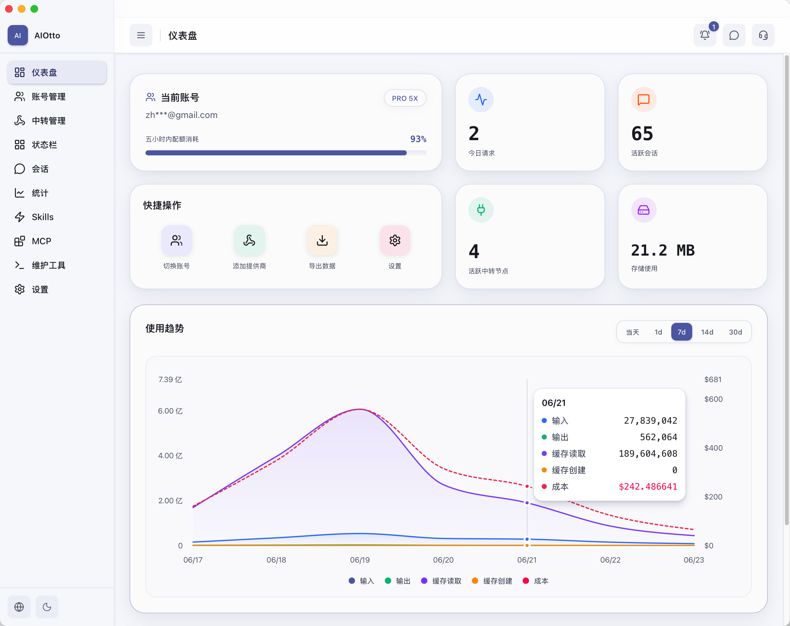

<p align="center">
  
</p>

<h1 align="center">Aiotto</h1>

<p align="center">
  <strong>把 Codex 的账号、模型、会话和本地状态，收进一个 macOS 工作台。</strong>
</p>

<p align="center">
  简体中文 · <a href="./README_EN.md">English</a>
</p>

<p align="center">
  <a href="https://github.com/ShawnZhuge/aiotto/releases/latest"></a>
  <a href="https://github.com/ShawnZhuge/aiotto/releases"></a>
  
  
  
</p>

<p align="center">
  <a href="https://github.com/ShawnZhuge/aiotto/releases/latest"><strong>下载最新版</strong></a>
  ·
  <a href="https://github.com/ShawnZhuge/aiotto/issues">问题反馈</a>
  ·
  <a href="#从源码运行">从源码运行</a>
</p>

<p align="center">
  
</p>

## 为什么需要 Aiotto

Codex 用久以后，麻烦通常不在模型本身。账号额度、中转配置、历史会话、磁盘占用和扩展状态散落在不同地方，一个任务出问题时，很难马上判断该看哪里。

Aiotto 把这些状态放到同一个桌面应用里。先看清，再操作；涉及切换、清理或恢复时，界面会把影响和结果说清楚。

<table>
  <tr>
    <td width="50%"><strong>额度突然见底</strong><br />同时查看 5 小时与每周额度，设置提醒、额度计划，并按需切换可用账号。</td>
    <td width="50%"><strong>中转能填，却不知道能不能用</strong><br />查看模型、余额和延迟；先做连通性测试，再启用智能路由。</td>
  </tr>
  <tr>
    <td><strong>会话越积越多</strong><br />搜索、继续、归档和恢复会话；按真实占用判断哪些内容值得清理。</td>
    <td><strong>Token 花在哪里说不清</strong><br />按时间、模型和来源查看请求、缓存、Token 与成本趋势。</td>
  </tr>
  <tr>
    <td colspan="2"><strong>最怕改完回不去</strong><br />备份、恢复预览、只读诊断和操作后复检，降低账号切换、配置调整和清理的风险。</td>
  </tr>
</table>

<details>
<summary><strong>展开看五个痛点的具体处理方式</strong></summary>

### 1. 多账号有额度，但任务仍会突然中断

5 小时和每周额度的周期不同，多账号又各有套餐、重置时间与登录状态。Aiotto 把这些信息放在同一页，并提供阈值提醒、额度计划和按需切换；切换前说明影响，切换后刷新并确认结果。

### 2. 中转配置填完了，问题却要到发起任务时才暴露

地址、密钥、协议或模型名称任一项不匹配，都可能导致请求失败。Aiotto 可以先拉取模型、检查余额和延迟、测试连通性并解释常见错误，再决定是否启用智能路由；不用时有明确的关闭路径。

### 3. 会话找不到、读不动，也不敢随便删

Aiotto 支持搜索、筛选、置顶和继续会话，长会话有目录和清晰的消息角色。清理时先看真实占用和候选范围，归档、回收、恢复与导出都有对应入口。

### 4. 请求很多，却不知道 Token 和成本主要花在哪

统计页把输入、输出、缓存、请求数、模型来源和成本放到同一时间轴，并区分官方与中转来源。OpenAI 状态页单独显示外部服务事故，避免把服务异常误判为本机配置问题。

### 5. 设置分散，最担心修改以后无法恢复

账号、模型服务、Skills、MCP 和本地维护涉及不同状态。Aiotto 提供备份历史、恢复预览和只读诊断；需要修改或清理时先确认范围，完成后重新检查结果。

</details>

## 一个界面，看清今天的 Codex

<p align="center">
  
</p>

<p align="center"><sub>账号、额度、请求、会话、存储与使用趋势集中展示。截图使用演示数据。</sub></p>

## 核心能力

| 你要处理的事 | Aiotto 能做什么 |
| --- | --- |
| 账号与额度 | 管理账号快照、查看套餐与凭据健康度、比较额度窗口、设置提醒和额度计划 |
| 模型与路由 | 管理兼容模型服务、拉取模型、检查余额与延迟、测试连接、启停智能路由 |
| 会话与存储 | 搜索和继续会话，置顶、归档、回收、恢复、导出，并查看本地占用与清理建议 |
| 用量与状态 | 汇总请求、Token、缓存、模型来源和成本，查看 OpenAI、ChatGPT 与 Codex 服务状态 |
| macOS 状态栏 | 不打开主窗口也能看账号额度、中转、最近会话和服务状态，并快速进入对应页面 |
| 扩展与维护 | 查看 Skills、MCP 和备份状态，运行诊断、安全清理、更新检查与常见恢复操作 |

## 三条常用路径

1. **额度接力：** 看额度 → 设置提醒或计划 → 选择可用账号 → 确认后切换。
2. **接入模型：** 添加服务 → 拉取模型 → 测试连接与余额 → 启用路由；不用时可关闭。
3. **整理会话：** 找到旧任务 → 查看占用 → 预览清理范围 → 备份后处理并重新扫描。

<details>
<summary><strong>展开查看完整功能清单</strong></summary>

### 账号与额度

- 集中显示账号、套餐、当前登录状态、凭据健康度和最近刷新结果。
- 查看 5 小时额度、每周额度、重置时间与限额重置额度。
- 保存、导入、导出、排序、删除和切换账号快照。
- 分别设置额度阈值、刷新频率、切换策略和五小时额度计划。
- 提供安全登出、重新登录和切换结果确认；不要求提交账号密码或验证码。

### 中转管理与智能路由

- 管理 OpenAI-compatible 与 Anthropic-compatible 模型服务。
- 拉取和选择模型，查看余额、延迟、协议、网络模式与启用状态。
- 运行连通性测试，解释常见错误，并导入、导出或预览配置。
- 在官方模型与中转模型之间选择，关闭后可回到正常的官方使用路径。
- 支持模型显示标识、API 登录模式和生图工具兼容设置。

### 会话、存储与备份

- 搜索、筛选、置顶、继续、归档、回收、恢复和导出本地会话。
- 为长会话提供目录，区分用户、AI 与内部记录，并适配宽窄窗口。
- 查看 Codex 本地存储构成、会话占用和可清理候选。
- 活跃、置顶、运行中和近期更新的会话不会被直接列为清理候选。
- 查看备份历史、恢复预览和导出位置；恢复前保护当前状态，完成后复检。

### 统计、状态与提醒

- 按时间范围查看请求、输入输出 Token、缓存读写、成本和模型来源。
- 区分官方与中转使用情况，帮助判断主要消耗来自哪里。
- 查看 OpenAI、ChatGPT 与 Codex 的服务状态、事故进展和恢复情况。
- 支持应用内提醒、macOS 通知、消息与公告。
- 状态栏可显示账号额度、中转余额、智能路由、最近会话和常用入口。

### Skills、MCP、维护与设置

- 查看 Skills 与 MCP 的来源、状态、基础信息和健康结果。
- 运行系统诊断、安全清理、Codex 进程处理和常见异常恢复。
- 支持跟随系统、浅色、深色模式，以及多套主题色和中英文界面。
- 配置登录启动、窗口行为、账号网络、刷新频率、通知动效和隐私选项。
- 检查和安装更新，并提供反馈、消息公告与项目支持入口。

</details>

## 下载与安装

Aiotto 当前支持 macOS 12 Monterey 或更高版本，提供 Apple Silicon 与 Intel 通用安装包。

1. 打开 [最新 Release](https://github.com/ShawnZhuge/aiotto/releases/latest)。
2. 下载文件名以 `_universal.dmg` 结尾的安装包。
3. 打开 DMG，把 Aiotto 拖入“应用程序”。

<details>
<summary><strong>macOS 首次打开提示“无法验证”或“应用已损坏”</strong></summary>

当前安装包尚未完成 Apple Developer ID 签名与公证。请先确认文件来自本项目的 GitHub Release，然后在 Finder 中右键 Aiotto，选择“打开”。如果系统仍然阻止启动，可执行：

```bash
xattr -cr /Applications/Aiotto.app
```

</details>

## 常见问题

<details>
<summary><strong>Aiotto 会替我登录 Codex 吗？</strong></summary>

不会。请先通过 Codex 的正常流程完成登录，再由 Aiotto 保存账号状态。Aiotto 不要求你提交账号密码、验证码或 Cookie。

</details>

<details>
<summary><strong>使用中转模型后，还能回到官方模型吗？</strong></summary>

可以。智能路由有明确的启用与关闭流程。关闭后会回到官方使用路径，操作前请核对确认界面显示的影响范围。

</details>

<details>
<summary><strong>为什么关掉窗口后 Aiotto 还在运行？</strong></summary>

状态栏、额度提醒和智能路由需要在后台保持工作。关闭窗口只会隐藏主界面；需要完全退出时，请使用状态栏里的“退出 Aiotto”或按 `Command + Q`。

</details>

<details>
<summary><strong>支持 Windows 或 Linux 吗？</strong></summary>

目前只提供 macOS 12+ 通用安装包。

</details>

## 从源码运行

普通用户建议直接安装 Release。想查看界面或参与改进，可以在本地运行：

```bash
git clone https://github.com/ShawnZhuge/aiotto.git
cd aiotto
pnpm install
pnpm dev
```

<details>
<summary><strong>构建检查</strong></summary>

```bash
pnpm build
cargo check --locked --manifest-path src-tauri/Cargo.toml
pnpm tauri:build
```

</details>

## 安全与隐私

- 不要在 Issue、截图或日志中上传账号凭据、API Key、令牌或个人信息。
- 切换账号、修改配置、恢复数据和执行清理前，请核对界面展示的影响与备份状态。
- 使用第三方模型服务时，请自行确认其计费方式、数据处理政策与服务条款。

## 反馈与许可证

欢迎通过 [GitHub Issues](https://github.com/ShawnZhuge/aiotto/issues) 提交问题和建议。项目采用 [Apache License 2.0](LICENSE)。

Aiotto 是独立的 Codex 本地工作流工具，与 OpenAI 无隶属、背书或赞助关系。
